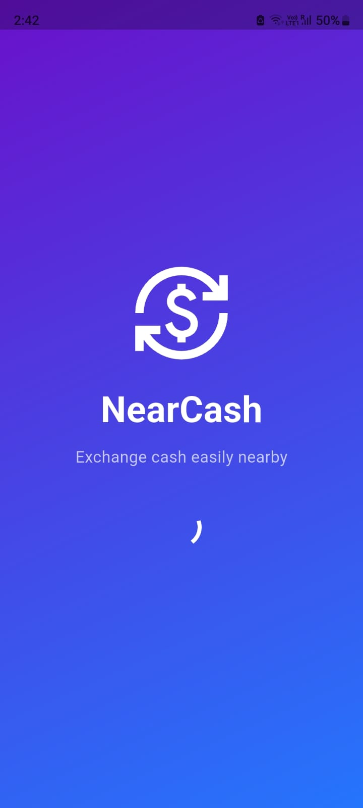
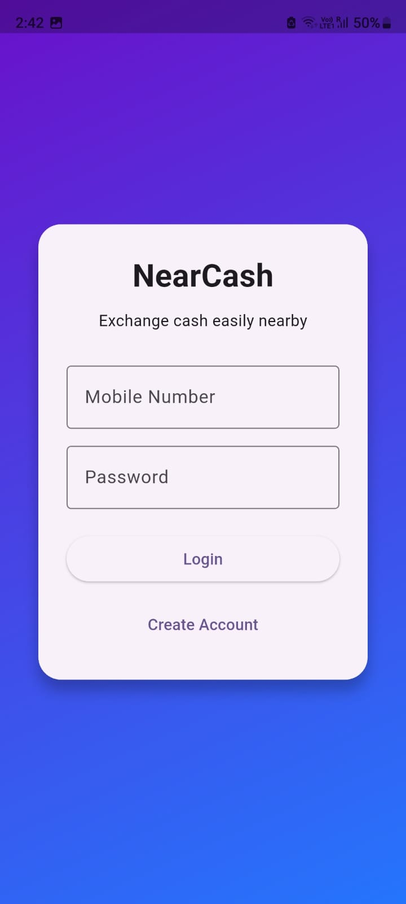
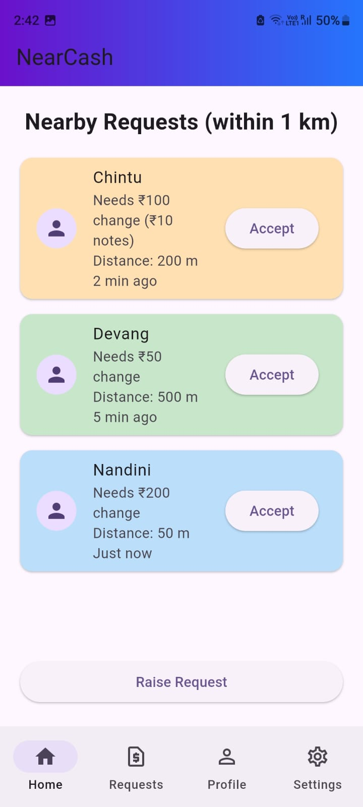
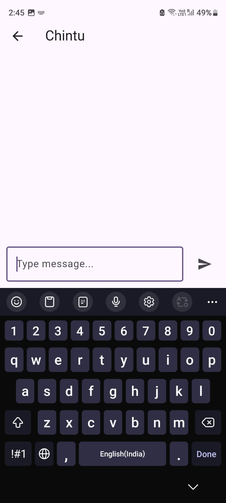
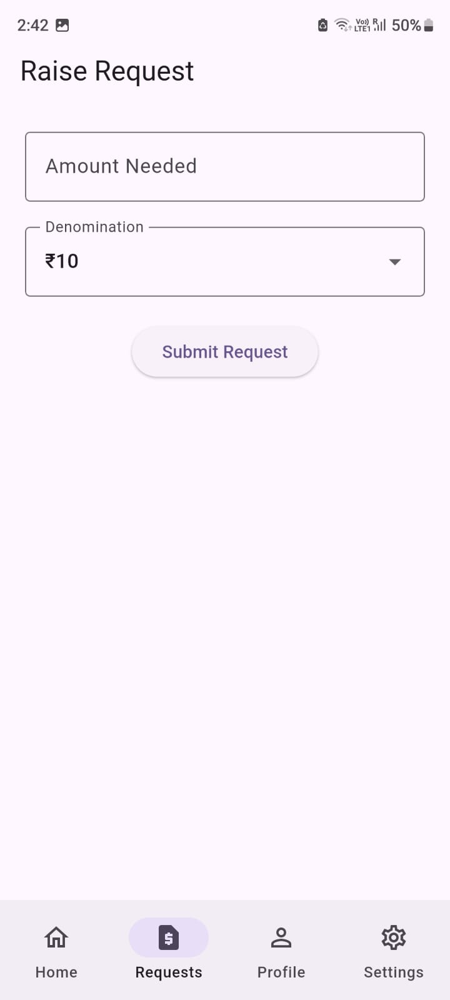
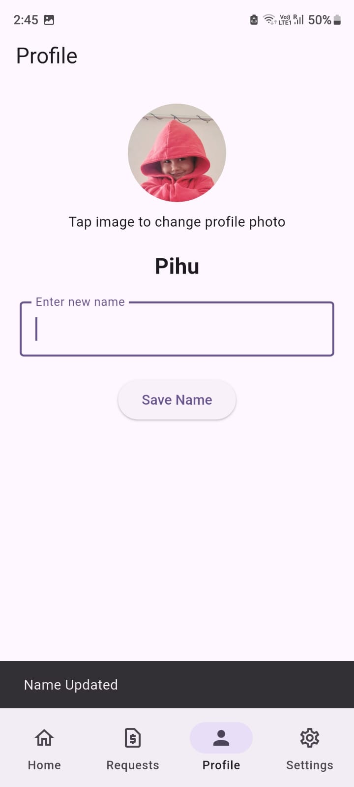
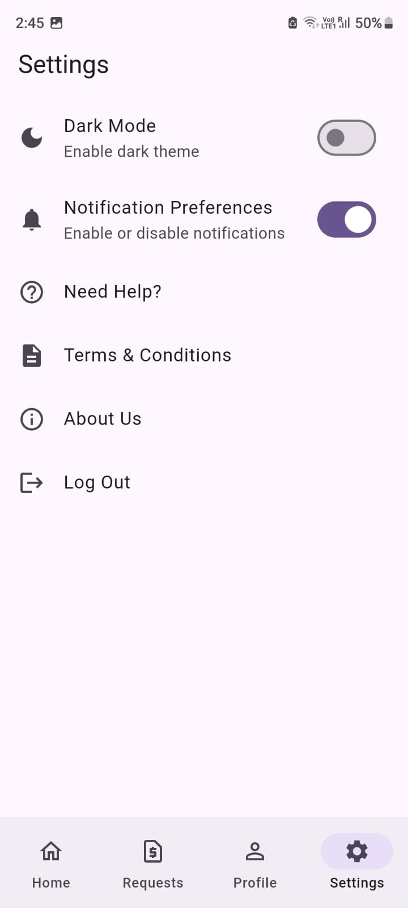

# NearCash Demo App

NearCash is a Flutter demo application that allows nearby people to exchange cash denominations within a 1 km radius.  
Users can raise requests, accept nearby requests, and chat to coordinate the exchange.

---

## Tech Stack

- Flutter
- Dart
- Material UI

---

## Features

- Login screen with mobile validation
- Raise cash exchange request
- View nearby requests (within 1 km simulation)
- Accept request and start chat
- Profile update with photo
- Settings page
- Success animation on request accept
- Demo APK included

---

## Download APK

Download and install the demo app:

[Download APK](app-release.apk)

---

## Screenshots

<table>
<tr>
<td align="center">Starting</td>
<td align="center">Login</td>
<td align="center">Home</td>
</tr>
<tr>
<td></td>
<td></td>
<td></td>
</tr>

<tr>
<td align="center">Chat</td>
<td align="center">Request</td>
<td align="center">Profile</td>
</tr>
<tr>
<td></td>
<td></td>
<td></td>
</tr>

<tr>
<td align="center">Settings</td>
</tr>
<tr>
<td></td>
</tr>
</table>

---

## Project Structure

---

## Author

Aditya Jaiswal
Chintu Garg
Aarav Jain
Vansh Bhatia
Devang Kapil
Garv chanana
Nandini 
