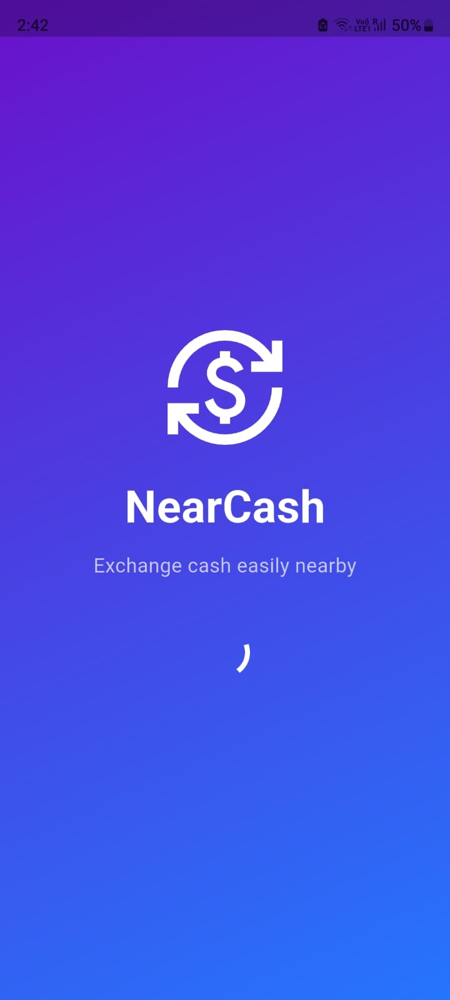
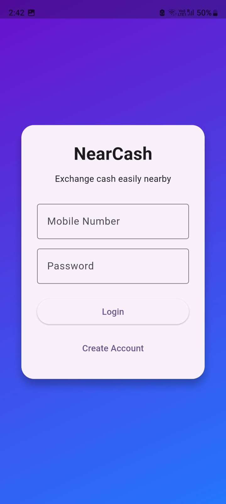
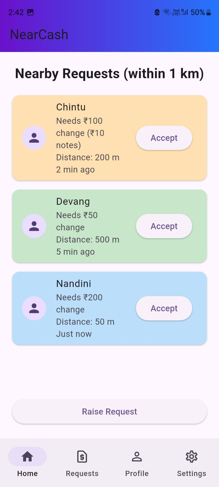
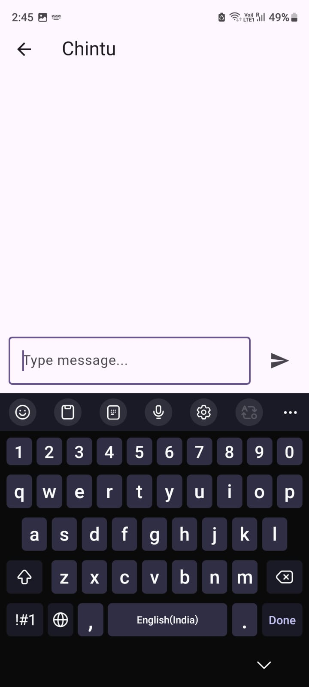
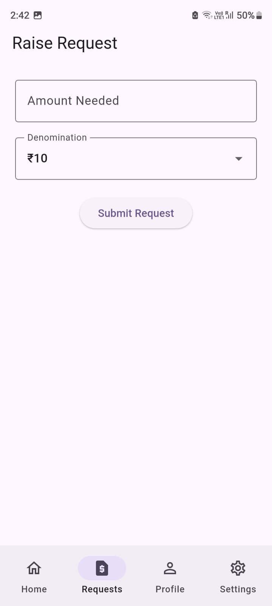
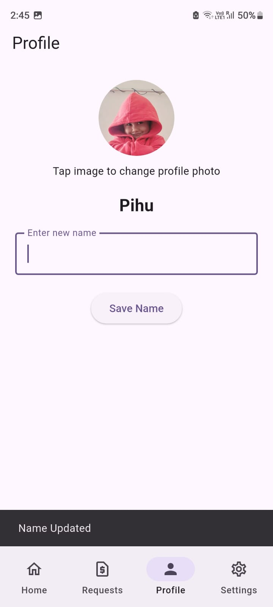
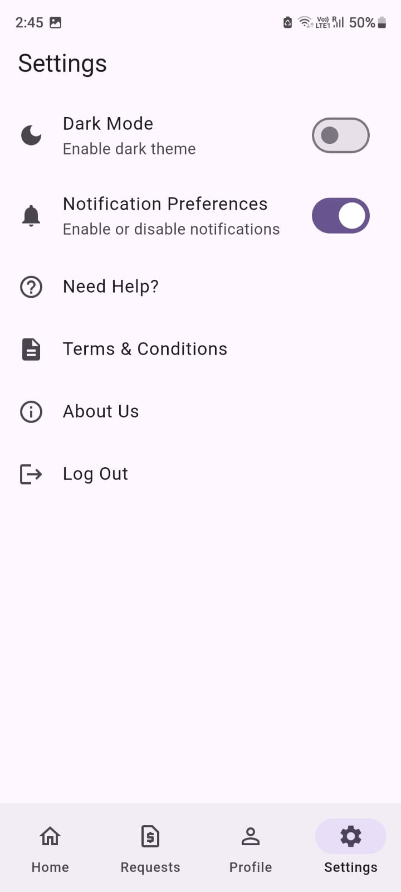

# 💸 NearCash — Smart Nearby Cash Exchange App

NearCash is a modern **Flutter mobile application** that helps nearby users exchange cash denominations quickly and securely within a **1 KM radius**.

Need ₹500 in smaller notes? Need change for cash payments? NearCash connects nearby users instantly for real-world cash exchange.

Built as a demo product using **Flutter + Dart**, focused on clean UI, smooth user experience, and location-based interactions.

---

## 🚀 Project Highlights

✨ Nearby cash exchange within 1 KM  
✨ Clean and modern mobile UI  
✨ Real-time request acceptance flow  
✨ In-app chat for coordination  
✨ Profile customization  
✨ Smooth animations and interactions  

---

## 🎯 Core Features

### 🔐 User Authentication
Secure login with mobile number validation.

✔ Mobile number verification  
✔ Input validation  
✔ Clean onboarding experience  

---

### 💵 Raise Cash Exchange Request

Users can create requests like:

📌 Need ₹500 in ₹100 notes  
📌 Need ₹2000 broken into smaller notes  
📌 Need exact cash change  

Users can specify:

✅ Amount  
✅ Required denomination  
✅ Current location  

---

### 📍 Nearby Request Discovery

The app shows nearby requests within:

🎯 **1 KM Radius**

Users can:

✔ Browse nearby requests  
✔ View request details  
✔ Connect instantly  

---

### 🤝 Accept Request

When a user accepts a request:

✨ Success animation appears  
✨ Request gets locked  
✨ Chat opens automatically  

---

### 💬 In-App Chat

Users can coordinate:

📍 Meeting location  
⏰ Time  
💵 Cash details  

Fast and simple communication.

---

### 👤 Profile Management

Users can:

✅ Upload profile photo  
✅ Update personal details  
✅ Manage account settings  

---

### ⚙ Settings

Includes:

🌙 App preferences  
🔔 Notification controls  
🔒 Privacy settings  

---

## 📱 App Screens

Screens included:

📌 Login Screen  
📌 Home Dashboard  
📌 Raise Request Screen  
📌 Nearby Requests Screen  
📌 Chat Screen  
📌 Profile Screen  
📌 Settings Screen  

---

## 🛠 Tech Stack

| Technology | Usage |
|------------|------|
| Flutter | Cross-platform app development |
| Dart | Core programming language |
| Material Design | UI/UX design |
| Firebase *(optional)* | Backend/Auth |
| Location Services | Nearby user simulation |

---

## 📂 Project Structure

```bash
lib/
├── screens/
├── widgets/
├── models/
├── services/
├── assets/
└── main.dart
```

---

## 📦 Demo APK

📲 Download and install the demo app:

**👉 Download APK**

(app-release.apk)

---

## Screenshots

<table>
<tr>
<td align="center">Starting</td>
<td align="center">Login</td>
<td align="center">Home</td>
</tr>
<tr>
<td></td>
<td></td>
<td></td>
</tr>

<tr>
<td align="center">Chat</td>
<td align="center">Request</td>
<td align="center">Profile</td>
</tr>
<tr>
<td></td>
<td></td>
<td></td>
</tr>

<tr>
<td align="center">Settings</td>
</tr>
<tr>
<td></td>
</tr>
</table>

---

## 👨‍💻 Team Members

| Name | UID |
|------|------|
| Aditya Jaiswal | 25BCS11532 |
| Nandini | 25BCS10455 |
| Garv Chanana | 25BCS13040 |
| Aarav Jain | 25BCS10245 |
| Devang Kapil | 25BCS10220 |
| Vansh Bhatia | 25BCS13086 |
| Chintu Garg | 25BCS10210 |
| Mani Kamboj | 25BCS13027 |
| Aman Raj | 25BCS10101 |

---

## ⭐ Project Status

✅ UI Completed  
✅ Features Integrated  
✅ APK Generated  
✅ Demo Ready  
✅ GitHub Uploaded  

---

### Made with ❤️ using Flutter
